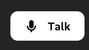
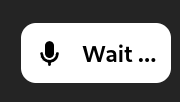
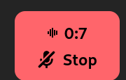

# PlayAI widget

### Шаги для создания виджета
1. Скопируйте этот репозиторий к себе на устройство
2. Установите зависимости командой: `npm install`
3. Вставьте свой agentId в файл `config.ts`
4. Создайте виджет в формате .html файла командой: `npm run build`

**Готово, в папке `dist` появится файл `index.html`**

### Вид виджета
#### inactive

#### connecting

#### active

